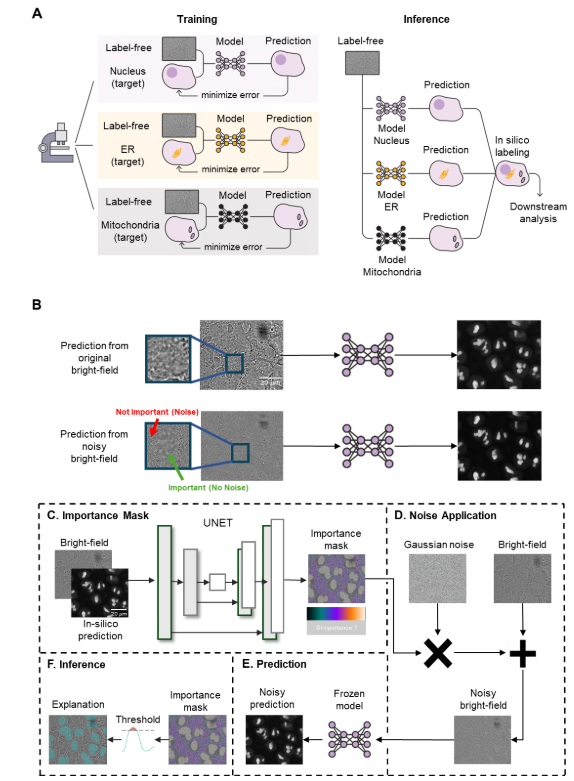
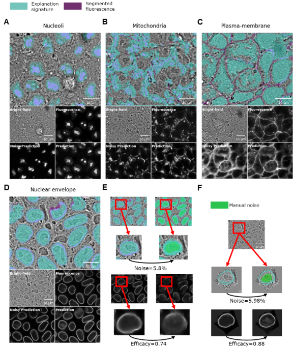

# MaskInterpreter

## Overview

Deep learning models often operate as "black boxes," making it difficult to understand which input features drive their predictions. MaskInterpreter addresses this by learning a mask generator network that identifies important regions through a novel training objective:

- **Preserve predictions**: Important regions (high mask values) should be sufficient to maintain the model's original prediction
- **Minimize mask size**: The mask should be as minimal as possible, highlighting only truly essential regions
- **Target correlation**: Predictions on masked inputs should maintain a specified correlation with original predictions

### Key Features

- **Self-supervised training** - No ground truth explanations needed
- **Model-agnostic** - Works with any differentiable predictor (classifiers, regressors, image-to-image models)
- **Quantifiable explanations** - Mask efficacy measured via Pearson Correlation Coefficient (PCC)

> **PyTorch Implementation**: For a PyTorch version of MaskInterpreter and tools for supervised prediction quality assessment at inference using MaskInterpreter, see the companion repository: [https://github.com/zaritskylab/Interpretability](https://github.com/zaritskylab/Interpretability)


<p align="center">
  
</p>

**Figure 1. Interpreting in silico labeling using Mask Interpreter**. (A) In silico labeling. Training (left): organelle-specific in silico labeling models are trained using matched label-free and their corresponding organelle-specific fluorescence images. Inference (right): pre-trained in silico labeling models are used to computationally translate each label-free image to multiple in silico labeled organelles’ fluorescence images. (B) An example showing the Nucleoli’s in silico labeling from the unperturbed bright-field image (top) and from the noisy bright-field image (bottom). The noisy image is generated by adding Gaussian noise to regions deemed less important by the Mask Interpreter’s derived importance mask. Arrows point to unimportant regions to which noise was added (red) and important regions that were kept intact (green). Note that both in silico labeled predictions are similar, indicating that the in silico labeling model primarily relies on the regions in the bright-free that were deemed as important by Mask Interpreter. Scale bar = 20 μm. (C-F) Schematic of the Mask Interpreter training and inference pipeline. (C) Importance Mask: The Mask Interpreter generates an importance mask using the bright-field image and its corresponding pre-trained in silico labeling model’s prediction. Scale bar = 20 μm. (D) Noise Application: A noisy bright-field image is constructed by adding Gaussian noise to the original image. The noise at each voxelspixel is modulated by the importance mask introducing more noise in less important regions. (E) Prediction: The pre-trained in silico labeling model is applied to the noisy bright-field image to generate an in silico labeled prediction. The optimization process minimizes the integrated voxelspixel values in the importance mask (maximizing noise) while simultaneously ensuring the in silico prediction from the noisy bright-field image remains highly correlated (PCC ≥ 0.9) and similar (minimum MSE) to the prediction from the unperturbed bright-field image (see text and Methods). (F) Inference: The trained Mask Interpreter generates an importance mask that is thresholded to create the binarized explanation signature which provides intuitive visual explanations of the image-to-image translation model's inner workings.

<p align="center">
  
</p>

**Figure 2. Explanation signatures reveal organelle-specific stereotypical regions that are essential for in silico localization**. (A-D) A manually selected in-focus z-slice of a representative field of view is shown for each organelle with an overlay of the explanation signature (light teal) and the segmented fluorescence image (purple, see Methods). Light purple regions indicate the intersection between the explanation signature and the segmentation (top). The bottom quartet shows the corresponding (top-left to bottom-right) bright-field image, fluorescence image, in silico prediction from the noisy bright-field image (“noisy prediction”) and the in silico labeling from the unperturbed bright-field image (“prediction”)(E) Manual and gradual introduction of noise in the bright-field image regions corresponding to the nuclear interior (top, in green) diminished the efficacy quality of the in silico Nuclear envelope prediction, efficacy was measured by pearson correlation between predictions of noisy and original bright-filed images (bottom). This direct manipulation underscores the importance of the nucleus in providing the spatial context necessary for accurately localizing the Nuclear envelope. (F) Manual and gradual introduction of noise in the bright-field image, in the single cell resolution. Bright-field image regions corresponding to the nuclear interior did not diminish the efficacy of the single cell in silico model prediction.


## Installation

### Prerequisites

- Python 3.9+
- CUDA-compatible GPU (recommended)
- Conda (recommended for environment management)

### Setup

1. **Clone the repository**
```bash
git clone https://github.com/lionben89/cell_generator.git
cd cell_generator
```

2. **Create conda environment**
```bash
conda create -n maskinterpreter python=3.9 tensorflow-gpu=2.6
conda activate maskinterpreter
```

3. **Install the package**
```bash
pip install -r requirements.txt
```

This will install all dependencies from `requirements.txt` automatically.

### Verify Installation

```python
import tensorflow as tf
print("GPUs Available:", tf.config.list_physical_devices('GPU'))

from models.MaskInterpreter import MaskInterpreter
print("MaskInterpreter imported successfully!")
```

## Data Download

### Allen Cell Collection Dataset

The project uses the Allen Cell Collection dataset from AWS S3. To download and prepare the full field-of-view (FOV) dataset:

```bash
cd create_data
python download_and_create_dataset_full.py
```

### Configuration Parameters

Edit the script to customize the download. Key parameters in `download_and_create_dataset_full.py`:

| Parameter | Description | Default Value |
|-----------|-------------|---------------|
| `num_threads` | Number of parallel download threads | `4` |
| `storage_root` | Main directory to save downloaded data | `"/groups/assafza_group/assafza/full_cells_fovs/"` |
| `temp_storage_root` | Temporary directory for processing (use SSD for speed) | `"/scratch/.../full_cells_fovs/"` |
| `num_of_images_per_organelle` | Maximum images to download per organelle | `200` |
| `resacle_z` | Z-axis rescaling factor | `3` |
| `only_csvs` | If `True`, creates metadata CSVs only (no images) | `True` |
| `override` | If `True`, re-downloads existing images | `False` |
| `organelles` | Dictionary of organelles to download | See below |

### Available Organelles

The script supports downloading the following organelles (uncomment in the `organelles` dictionary):

```python
organelles = {
    "Desmosomes": [],
    "Golgi": [],
    "Microtubules": [],
    "Nuclear-envelope": [],
    "Actin-filaments": [],
    "Plasma-membrane": [],
    "Nucleolus-(Dense-Fibrillar-Component)": [],
    "Mitochondria": [],
    "Endoplasmic-reticulum": [],
    "Tight-junctions": [],
    "Nucleolus-(Granular-Component)": [],
    "Actomyosin-bundles": [],
    "Endosomes": []
}
```

### Output Structure

Each downloaded image is a multi-channel TIFF with:
- **Channel 0**: Bright-field image (ROI)
- **Channel 1**: DNA fluorescence (raw ROI)
- **Channel 2**: Membrane fluorescence (raw ROI)
- **Channel 3**: Structure/organelle fluorescence (raw ROI)
- **Channel 4**: DNA segmentation (ROI)
- **Channel 5**: Membrane segmentation (ROI)
- **Channel 6**: Structure/organelle segmentation (ROI)

The script also generates a metadata CSV for each organelle with image paths and metadata.

### Example Usage

To download 50 images each of Mitochondria and Golgi:

```python
# Edit download_and_create_dataset_full.py
num_of_images_per_organelle = 50
only_csvs = False  # Actually download images
organelles = {
    "Mitochondria": [],
    "Golgi": []
}
```

Then run:
```bash
python download_and_create_dataset_full.py
```

## Usage

### Model Types and Differences

MaskInterpreter supports three types of predictive models:

| Model Type | Use Case | Output | Loss Function | Example Application |
|------------|----------|--------|---------------|---------------------|
| **Image-to-Image** | Pixel-wise prediction | 2D/3D image | MSE + L1 mask + PCC target | Organelle prediction, segmentation |
| **Regression** | Continuous value prediction | Scalar(s) | MSE + L1 mask + PCC target | Cell cycle markers, protein levels |
| **Classification** | Category prediction | Class probabilities | MSE + L1 mask + PCC target | CIFAR-10

**Key Differences:**
- **Image-to-Image**: Preserves spatial predictions (e.g., fluorescent organelle images from brightfield)
- **Regression**: Explains scalar outputs (e.g., predicting Cdt1/Geminin marker intensities)
- **Classification**: Identifies regions affecting class probability distributions

All variants share the same core principle: minimize the mask while maintaining high correlation between predictions on original vs. adapted (masked + noise) inputs.

### Training: Image-to-Image Models

For image-to-image models (e.g., organelle prediction, segmentation):

```python
from models.MaskInterpreter import MaskInterpreter
from models.UNETO import get_unet
import tensorflow as tf

# Load your pre-trained predictor
predictor = tf.keras.models.load_model('your_model.h5')
predictor.trainable = False

# Create the mask generator (U-Net based)
adaptor = get_unet(<patch_size,num_filters>, activation="sigmoid")

# Initialize MaskInterpreter
mask_interpreter = MaskInterpreter(
    patch_size=<patch_size>,
    adaptor=adaptor,
    unet=predictor,
    pcc_target=0.95  # Target 95% correlation
)

# Compile with loss weights
mask_interpreter.compile(
    g_optimizer=tf.keras.optimizers.Adam(learning_rate=5e-4),
    similarity_loss_weight=1.0,
    mask_loss_weight=1.0,
    noise_scale=1.5, ## Noise that remove most of the signal. check figures/1_choose_noise_scale.py
    target_loss_weight=6
)

# Train
mask_interpreter.fit(
    x_train,
    epochs=200,
    batch_size=128,
    validation_data=(x_val, None)
)
```

### Training: Regression Models

For regression models that predict continuous values (e.g., cell cycle markers, protein concentrations):

```python
from models.MaskInterpreterRegression import MaskInterpreterRegression
from models.UNETO import get_unet
import tensorflow as tf

# Load your pre-trained regressor
regressor = tf.keras.models.load_model('cellcycle_marker1.h5')
regressor.trainable = False

# Create the mask generator
# Adaptor takes 2 channels: image + gradient magnitude
adaptor = get_unet((64, 64, 2), activation="sigmoid")

# Initialize MaskInterpreter for Regression
mask_interpreter = MaskInterpreterRegression(
    patch_size=(64, 64, 1),  # Original image size
    adaptor=adaptor,
    regressor=regressor,
    pcc_target=0.95
)

# Compile
mask_interpreter.compile(
    g_optimizer=tf.keras.optimizers.Adam(learning_rate=5e-4),
    similarity_loss_weight=1.0,
    mask_loss_weight=1.0,
    noise_scale=0.5,
    target_loss_weight=1.75
)

# Build the model
mask_interpreter(np.random.random((1, 64, 64, 1)).astype(np.float32))

# Train
mask_interpreter.fit(
    x_train,
    epochs=200,
    batch_size=128,
    validation_data=(x_val, None)
)
```

**Regression-specific notes:**
- Input augmentation includes gradient magnitude channel (adaptor input shape: [H, W, 2])
- Mask preserves regions important for predicting scalar outputs
- Example: Cell cycle marker prediction (Cdt1/Geminin intensities from brightfield images)

### Training: Classification Models

For classification models (e.g., CIFAR-10, cell type classification):

```python
from models.MaskInterpreterCLF import MaskInterpreter
from models.UNETO import get_unet
import tensorflow as tf

# Load your pre-trained classifier
classifier = tf.keras.models.load_model('cifar10_classifier.h5')
classifier.trainable = False

# Create the mask generator
# Adaptor takes augmented input (32 channels after preprocessing)
adaptor = get_unet((32, 32, 32), activation="sigmoid")

# Initialize MaskInterpreter for Classification
mask_interpreter = MaskInterpreter(
    patch_size=(32, 32, 3),  # Original CIFAR-10 image size
    adaptor=adaptor,
    classifier=classifier,
    weighted_pcc=False,
    pcc_target=0.95
)

# Compile
mask_interpreter.compile(
    g_optimizer=tf.keras.optimizers.Adam(learning_rate=5e-4),
    similiarity_loss_weight=1.0,
    mask_loss_weight=1.0,
    noise_scale=0.5,
    target_loss_weight=1.75
)

# Build the model
mask_interpreter(np.random.random((1, 32, 32, 3)))

# Train
mask_interpreter.fit(
    x_train,
    epochs=200,
    batch_size=128,
    validation_data=(x_val, None)
)
```

**Classification-specific notes:**
- Input augmentation includes gradient of max predicted probability (computed internally)
- Mask identifies regions affecting class probability distributions
- Works with multi-class outputs (softmax probabilities)
- Example: CIFAR-10 images (32×32×3 RGB images, 10 classes)

### Generating Importance Masks

```python
# Generate mask for a single image
mask = mask_interpreter(image[np.newaxis, ...])

# Visualize
import matplotlib.pyplot as plt
plt.imshow(image[:, :, 0], cmap='gray')
plt.imshow(mask[0, :, :, 0], cmap='jet', alpha=0.5)
plt.title("Importance Mask Overlay")
plt.show()
```

### Evaluating Mask Efficacy

```python
from metrics import tf_pearson_corr

# Original prediction
pred_orig = predictor(image[np.newaxis, ...])

# Create adapted image (important regions preserved, rest is noise)
noise = tf.random.normal(image.shape, stddev=noise_scale)
adapted = mask * image + (1 - mask) * noise

# Prediction on adapted image
pred_adapted = predictor(adapted[np.newaxis, ...])

# Mask efficacy = PCC between predictions
efficacy = tf_pearson_corr(pred_orig, pred_adapted)
print(f"Mask Efficacy (PCC): {efficacy:.4f}")
```


## Experiments

### Organelle Prediction (Label-Free Microscopy)

MaskInterpreter was validated on predicting fluorescent organelle labels from bright-field microscopy images using the Allen Cell Collection dataset.

**Supported Organelles:**
- Mitochondria
- Nuclear Envelope  
- Golgi Apparatus
- Endoplasmic Reticulum
- Microtubules
- Actin Filaments
- Plasma Membrane
- And more...

### Cell Cycle Marker Prediction

Extended to predict cell cycle markers (Cdt1, Geminin) from bright-field images:

```bash
# Train cell cycle regressor
python models/cellcycle-clf.py

# Train MaskInterpreter for cell cycle
python models/MaskInterpreterRegression.py

# Evaluate and generate visualizations
python models/mi_reg_cellcycle_eval.py
```

### CIFAR-10 Classification

Demonstrated on image classification to show generality:

```bash
python clf-cifar10.py
```
```bash
python models/MaskInterpreterCLF.py
```

## Results

<p align="center">
  
</p>


## Citation

If you use MaskInterpreter in your research, please cite:

```bibtex
@article{TODO,
  title={TODO},
  author={Ben Nedava, Lion and Miller, Gad and Zaritsky, Assaf},
  journal={bioRxiv},
  year={2026}
}
```

## License

This project is licensed under the MIT License - see the [LICENSE](LICENSE) file for details.

## Acknowledgments

- Allen Institute for Cell Science for the cell imaging datasets

## Contact

- **Author**: Lion Ben Nedava, Gad Miller
- **Email**: lionben89@gmail.com, gadmicha@post.bgu.ac.il
- **Lab**: [Zaritsky Lab](https://www.https://www.assafzaritsky.com/)
