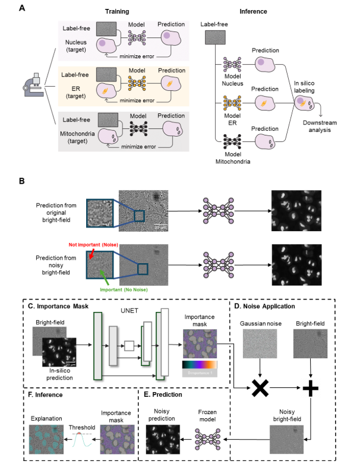

# MaskInterpreter | Trustworthy in silico labeling via semantic visual interpretability of image-to-image translation
[](https://creativecommons.org/licenses/by-nc/4.0/)

Lion Ben Nedava<sup>1*</sup>, Gad Miller<sup>1*</sup>, Nitsan Elmalam<sup>1</sup>, Mateheus Viana<sup>3</sup>, Jianxu Chen<sup>2</sup>, Nathalie Gaudreault<sup>3</sup>, Sussane Rafelski<sup>3</sup>, Assaf Zaritsky<sup>1</sup>

\*Equal contribution

1. Institute for Interdisciplinary Computational Science, Stein Faculty of Computer and Information Science, Ben-Gurion University of the Negev, Beer-Sheva 84105, Israel
2. Leibniz-Institut fur Analytische Wissenschaften - ISADS - e.V, Dortmund, Germany
3. Allen Institute for Cell Science, Seattle, WA, USA

## 1. Abstract

Cross-modality image translation promises to provide multiple layers of biological information from a single input, yet its practical application is stalled by a lack of interpretability and the inability to account for model imperfections. In silico labeling, the inference of organelle localization from label-free images, is a primary example where this black-box nature limits adoption. We present Mask Interpreter, a generalized method for semantic visual interpretability of image-to-image translation models. By uncovering organelle-specific "explanation signatures", we demonstrate that models leverage unique and reproducible biological patterns. Mask Interpreter outperforms traditional xAI approaches, identifies batch effects and localized prediction errors when ground-truth fluorescence is unavailable. Our supervised confidence modeling provides fine-grained reliability assessment at single-cell resolution, enabling the automated exclusion of artifacts from downstream analyses. By bridging the gap between computational inference and meaningful biological features, Mask Interpreter transforms in silico labeling into a rigorous, evidence-based instrument for scientific discovery across diverse biomedical imaging modalities.

<p align="center">
  
</p>

**Figure 1. Interpreting in silico labeling using Mask Interpreter**. (A) Training of in silico labeling models using matched label-free and fluorescence images. (B) Example of predictions with/without using MaskInterpreter’s importance mask. (C-F) Training and inference pipeline schematic. 

See Paper (link) for details.

## 2. Overview
Deep learning models often operate as "black boxes," making it difficult to understand which input features drive their predictions. MaskInterpreter addresses this by learning a per-organelle mask generator network that identifies important regions through a novel training objective:

- **Preserve predictions**: Important regions (high mask values) should be sufficient to maintain the model's original prediction
- **Minimize mask size**: The mask should be as minimal as possible, highlighting only truly essential regions
- **Target correlation**: Predictions on masked inputs should maintain a specified correlation with the original predictions

### Key Features
- **Self-supervised training** - No ground truth explanations needed
- **Model-agnostic** - Works with any differentiable predictor (e.g. classifiers, regressors, image-to-image models)
- **New measurement to quantify explanations** - the Pearson correlation coefficient (PCC) between the predictions derived from the unperturbed input, and the predictions derived from the importance mask-induced noisy inputs

## 3. Repository Structure

```
mask_interpreter/
├── README.md
├── pyproject.toml              # Package dependencies and configuration
├── example.ipynb               # Quick start tutorial notebook
│
├── md/                         # Documentation files
│   ├── quickstart.md           # Quick start guide
│   ├── data.md                 # Full data download instructions
│   ├── usage.md                # Usage examples and training
│   ├── examples.md             # Additional examples
│   └── reproduce.md            # Reproducing paper figures
│
├── models/                     # Core MaskInterpreter implementations
│   ├── MaskInterpreter.py      # Image-to-image models
│   ├── MaskInterpreterRegression.py   # Regression models
│   ├── MaskInterpreterCLF.py   # Classification models
│   ├── regressor_cellcycle.py  # Cell cycle marker regression
│   ├── clf-cifar10.py          # CIFAR-10 classifier
│   └── UNETO.py                # U-Net architecture for mask generation
│
├── create_data/                # Data download and preparation scripts
│   ├── download_and_create_dataset_full.py
│   ├── download_and_create_dataset_singlecell.py
│   ├── create_metadata.py
│   └── segment_and_create_pertrub_dataset.py
│
├── figures/                    # Scripts to reproduce paper figures
│   ├── 0_reproduce_unet_scores.py
│   ├── 1_choose_noise_scale.py
│   ├── 2_choose_th.py
│   ├── 3_calculate_unet_scores.py
│   ├── 4_calculate_explanation_mask_efficacy.py
│   └── ...
│
├── gui/                        # Graphical user interface
│   ├── gui.py
│   └── gui_logic.py
│
├── utils/                      # Utility modules
│   ├── callbacks.py            # Training callbacks
│   ├── metrics.py              # Evaluation metrics (PCC, etc.)
│   └── utils.py                # Helper functions
│
├── dataset.py                  # Data loading utilities
├── global_vars.py              # Global configuration and paths
├── mg_analyzer.py              # Mask generator analyzer
├── train.py                    # Main training script
└── test.py                     # Testing utilities
```

## 4. General Installation and setup

### Prerequisites

- Python 3.9+
- CUDA-compatible GPU (recommended)
- Conda (recommended for environment management)

### Download Trained Models and Example Data

Pre-trained models and example data are available from Zenodo for quick start and reproducibility.

#### Download from Zenodo

Visit the Zenodo repository to download the required files:

**Zenodo Link:** [https://zenodo.org/records/18590674](https://zenodo.org/records/18590674)

The archive contains:
- **Pre-trained in silico labeling models** - Trained on various organelles
- **Pre-trained MaskInterpreter models** - Corresponding interpretation models for each predictor
- **Example data** - Sample images with metadata for testing and validation
- **Train and test lists of the full data**

#### Extraction and Setup

After downloading, extract the contents and set the paths accordingly:

```bash
# Download the archive from Zenodo
wget https://zenodo.org/records/18590674/files/models_and_data.zip

# Extract to your desired location
unzip models_and_data.zip -d /path/to/your/directory

# The extracted files under models_and_data dir will contain:
# - example_data (example dataset with train/test CSV files)
# - models/ (pre-trained models)
# - train_test_list/ (train and test lists of the full data)
```

Make sure to update your environment variables (see next section) to point to these directories.

### Setup

1. **Clone the repository**
```bash
git clone https://github.com/lionben89/cell_generator.git
cd cell_generator
```

2. **Create conda environment**
```bash
conda create -n maskinterpreter python=3.9 tensorflow-gpu=2.6
conda activate maskinterpreter
```

3. **Install the package in editable mode**
```bash
pip install -e .
```

This will install all dependencies from `pyproject.toml` automatically


### Verify Installation

**Note**: Run this verification on the terminal of the computer/node with GPU access.

```bash
# Activate the environment
conda activate maskinterpreter

# Run verification script
python -c "
import warnings
warnings.filterwarnings('ignore')

import tensorflow as tf
print('GPUs Available:', tf.config.list_physical_devices('GPU'))

from models.MaskInterpreter import MaskInterpreter
print('MaskInterpreter imported successfully!')
"
```

### Configuration

The project uses `global_vars.py` for configuration including paths for data, models, and the repository. You can configure these either by:

Open [global_vars.py](global_vars.py) and update the path variables at the top of the file:

```python
# ============================================
# Path Configuration
# ============================================
# Base paths - update these to match your environment
BASE_PATH = '/path/to/your/data'
DATA_PATH = '/path/to/your/data/train_test_list'
CWD = 'current working dir'
```

**Note**: Those variables must be set **before** importing any project modules.

## 5. [Quick Start](md/quickstart.md)

## 6. [Full Data Download](md/data.md)

## 7. [Usage](md/usage.md)

## 8. [Additional Examples](md/examples.md)

## 9. [Recreate Figures from Paper](md/reproduce.md)

## PyTorch Implementation
> **PyTorch Implementation and implementation of supervised confidence model**: For a PyTorch version of MaskInterpreter and tools for assessing the supervised prediction quality at inference time using MaskInterpreter, see the companion repository: [https://github.com/zaritskylab/MaskInterpreter-Applications](https://github.com/zaritskylab/MaskInterpreter-Applications)

## Citation

If you use MaskInterpreter in your research, please cite:

```bibtex
@article{TODO,
  title={TODO},
  author={Ben Nedava, Lion and Miller, Gad and Zaritsky, Assaf},
  journal={bioRxiv},
  year={2026}
}
```

## Acknowledgments

- [Allen Institute for Cell Science](https://alleninstitute.org/cell-science) for the cell imaging datasets and review of the paper.

## Contact

- **Email**: assafzar@gmail.com , lionben89@gmail.com, gadmicha@post.bgu.ac.il
- **Lab**: [Zaritsky Lab](https://www.https://www.assafzaritsky.com/)
